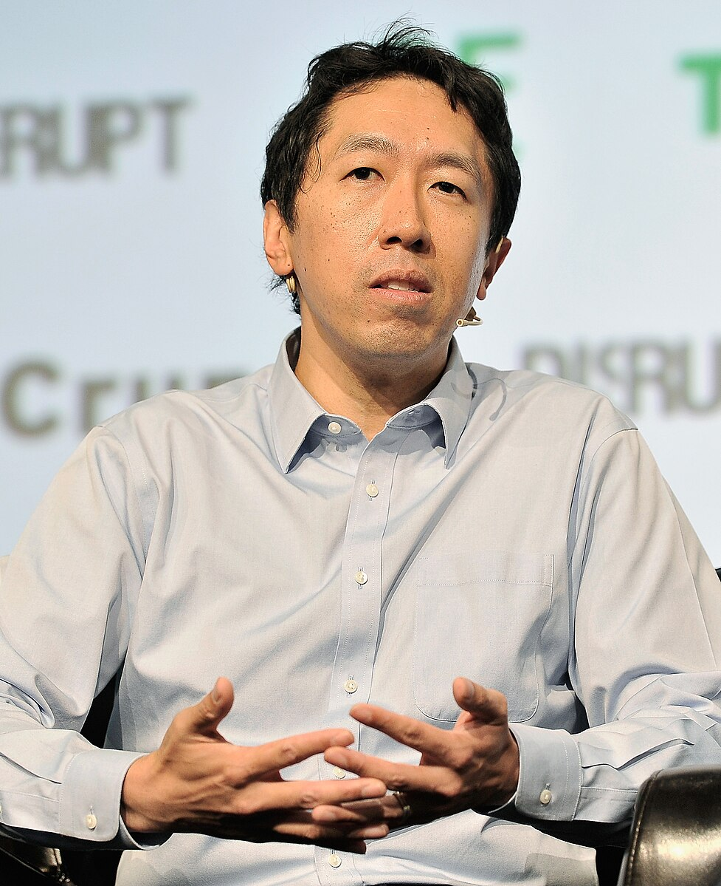
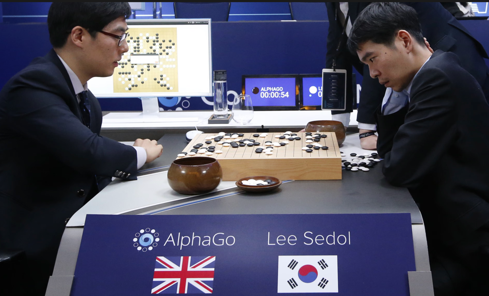
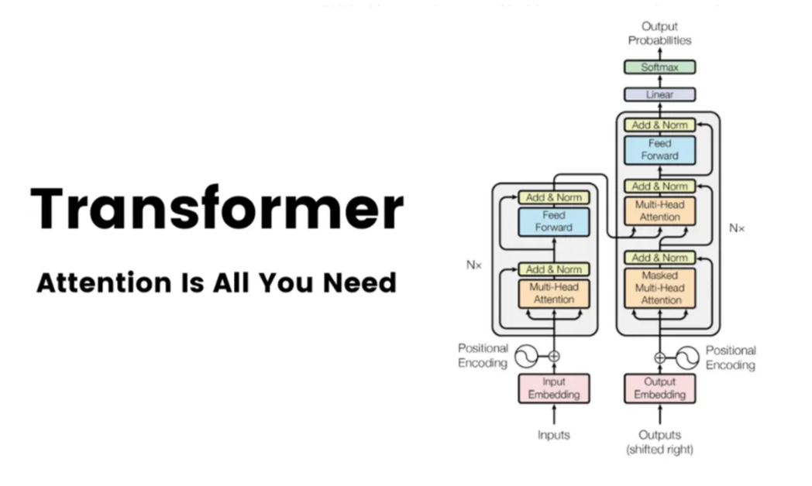
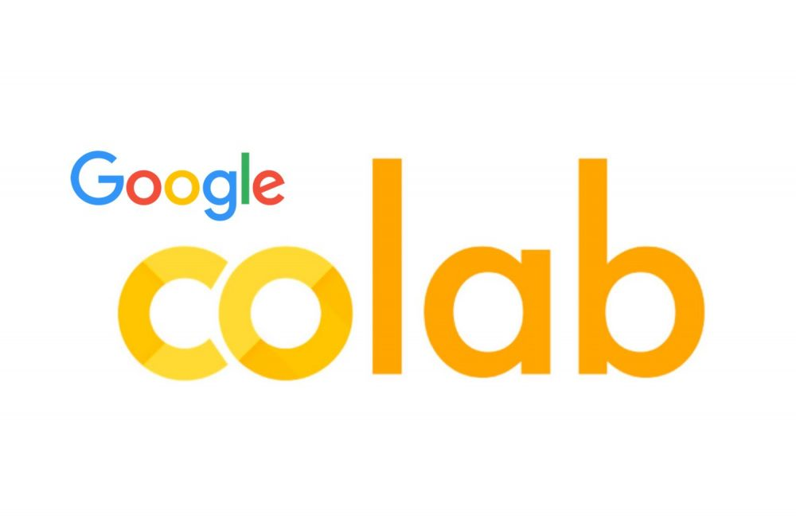

# Build AI the Google Way - Part 1
## Brief History of AI & Machine Learning at Google

Google’s evolution is tightly coupled with the evolution of **machine learning at scale**.  
From search ranking to modern foundation models, AI has always been central to Google’s mission.

---

## 1. Early Foundations (2001–2010)
**From algorithms to large-scale machine learning**

- Google Search was built on **PageRank**, a graph-based ranking algorithm that laid early groundwork for data-driven ranking systems
- Early applications of statistical machine learning included:
  - Search relevance & ranking
  - Spam and fraud detection
  - Ads targeting and optimization
- Google pioneered **large-scale distributed computing** to support ML long before “big data” became mainstream

**Key idea:**  
> Google’s earliest challenges were already ML problems at internet scale.

---

## 2. The Rise of Deep Learning (2011–2015)
**Neural networks enter production**

- 2011: **Google Brain** project launched to explore deep neural networks

- Deep learning significantly improved:
  - Speech recognition (Android, Voice Search)
  - Image recognition (Google Photos)
- 2014: Google acquired **DeepMind**, accelerating research in reinforcement learning and general AI

**Key impact:**  
Deep learning moved from research labs into **real user-facing products**.

---

## 3. Transformational Breakthroughs (2016–2019)
**Modern AI takes shape**

- DeepMind’s **AlphaGo** defeated the world champion in Go (2016)

- 2017: Google researchers introduced the **Transformer architecture**  
  - Foundation of modern NLP and large language models

- Google released **BERT**, dramatically improving search query understanding
- TensorFlow matured into one of the most widely used ML frameworks

**Key contribution:**  
> Many modern AI systems are built on research originating at Google.

---

## 4. Democratizing Machine Learning (2019–2021)
**From experts to everyone**

- Launch of **AutoML** tools to reduce ML entry barriers

- Expansion of **Tensor Processing Units (TPUs)** for faster training and inference

- Growth of ML services on **Google Cloud**:
  - Vision, Speech, Translation APIs
  - Managed ML pipelines

**Shift:**  
AI became a **platform**, not just an internal capability.

---

## 5. Foundation Models & Multimodal AI (2021–Present)
**AI as a general-purpose system**

- Development of large-scale **foundation models** (PaLM → Gemini)
- Models capable of reasoning across:
  - Text
  - Images
  - Audio
  - Code
- AI deeply integrated into:
  - Google Search
  - Workspace (Docs, Gmail)
  - Android
  - YouTube & Maps
- Introduction of **Vertex AI** as an end-to-end ML and GenAI platform

**Current focus:**
- Multimodal reasoning
- AI agents
- Responsible & safe AI deployment

---

## 6. Google’s Enduring Contributions to AI

- Large-scale ML infrastructure
- Transformer architecture
- Open-source tooling (TensorFlow, JAX)
- Specialized AI hardware (TPUs)
- Reinforcement learning breakthroughs
- Production-grade ML systems at global scale

---

## Key Takeaway

> Google’s impact on AI is not defined by a single model,  
> but by its ability to turn cutting-edge research into **planet-scale, reliable systems**.
`
